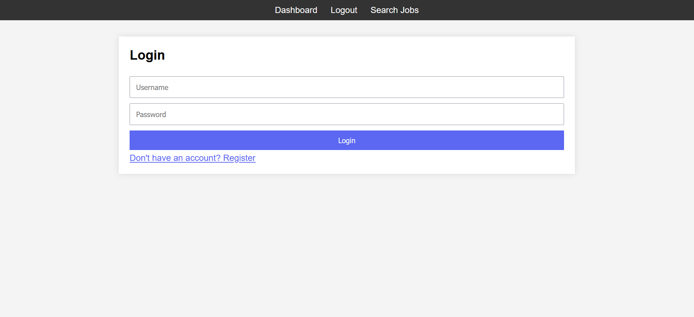
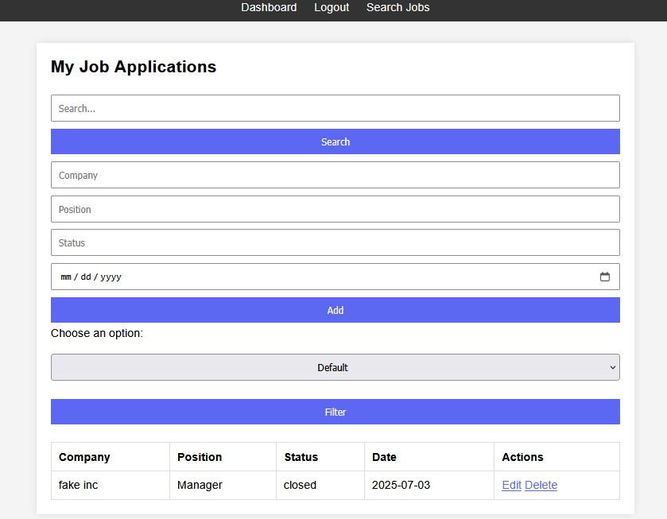
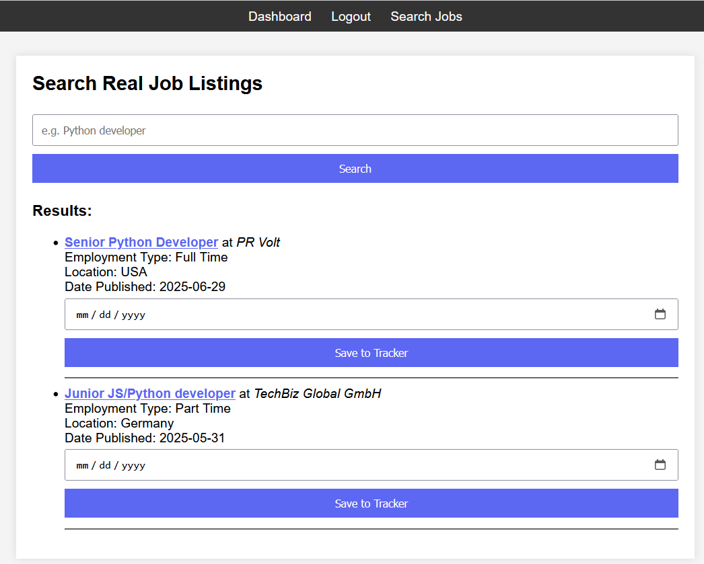

#  Job Tracker App

A full-stack web application to help users track job applications, search live job listings, and stay organized during the job hunt.

---

##  Features

-  User authentication (login & registration)
-  Full CRUD functionality for job applications
-  Real-time remote job search via Remotive API
-  SQLite database for persistent storage
-  Clean, responsive frontend using HTML/CSS (no frameworks)

---

##  Tech Stack

- **Backend:** Python, Flask
- **Database:** SQLite
- **Frontend:** HTML, CSS
- **External API:** [Remotive Job API](https://remotive.com/api)

---

##  Screenshots




---

##  Getting Started

1. **Clone the repo**
   ```bash
   git clone https://github.com/DKGProgrammer/Job-Tracker.git
   cd Job-Tracker